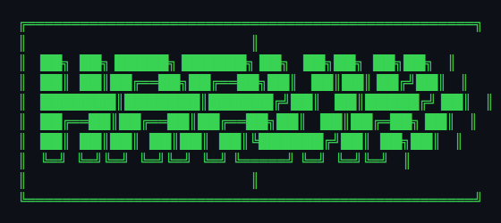

<!-- ╔══════════════════════════════════════════════════════════════╗ -->
<!-- ║  CYBERPUNK TERMINAL — Haruki Hiranaka's Profile README     ║ -->
<!-- ╚══════════════════════════════════════════════════════════════╝ -->

<div align="center">



</div>

---

```python
# ━━━━━━━━━━━━━━━━━━━━━━━━━━━━━━━━━━━━━━━━━
# 🖥️  SYSTEM PROFILE — CLASSIFIED INTEL
# ━━━━━━━━━━━━━━━━━━━━━━━━━━━━━━━━━━━━━━━━━

haruki = {
    "role":      "Software Engineer | University Student | AI/ML Engineer (予定)",
    "location":  "Japan 🇯🇵",
    "interests": ["Web Development", "AI/ML", "Competitive Programming"],
}
```

---

<div align="center">


<br/>
<br/>


</div>

---

<div align="center">


</div>

---

<div align="center">


<br/>

<a href="https://git.io/typing-svg">
  
</a>

</div>
